# Slamby TAU (0.12.0)

*Integrated data management tool, dedicated for data-scientists and managers.
Quick real-time data access, data-analysis and data-processing.*

Slamby TAU is an open-source software, using Slamby SDK, communicating real-time with Slamby Server.

`Github` Project Page: [https://github.com/slamby/slamby-tau/](https://github.com/slamby/slamby-tau)

License: [Apache License 2.0](LICENSE)

# Quick Overview

First let's examine TAU structure, logic and main parts:

Part Name   |   Description
--- |   ---
Header  |   Top navigation area, displaying the active window name, dataset-selector menu and drop-down settings.
Left Menu   |   Main menu selector is on the left sidebar, displaying the main menu items. Currently Dataset, Data end Services are available.
Status Bar   |   Orange colored status bar at the bottom. Contains additional information and status window button.

*Example TAU print screen*:

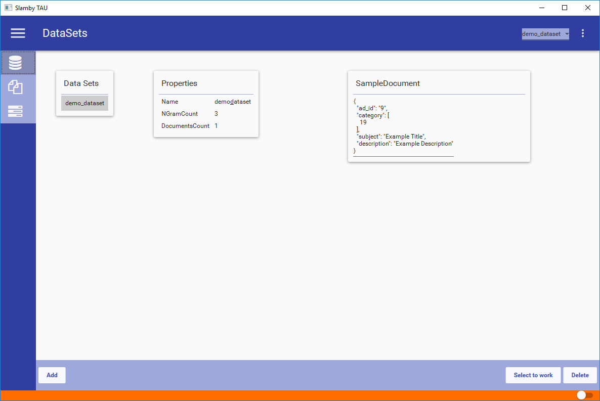

### Header

#### Dataset Selector

Quick dataset selector. Check your available datasets in drop-down menu and select one to work with.

> Using TAU you can select one active dataset to work with. Basically you can set a dataset to work with in Dataset menu, or select a new one in this quick selector.

#### Settings

Drop-down settings menu at the top right corner.

*Available Menu Items:*

Name    |   Description
--- |   ---
Settings    |   Available TAU configuration settings. *Server Settings:* Slamby Server URL & API Secret, *BulkImportSize*: bulk size during import process.
Refresh |   Refresh TAU. Shortcut key: `F5`.
Help    |   Open Slamby Developers site http://developers.slamby.com.
About   |   Slamby TAU Version number.

> Tip: use Refresh by pressing F5

*TAU drop-down settings menu*:

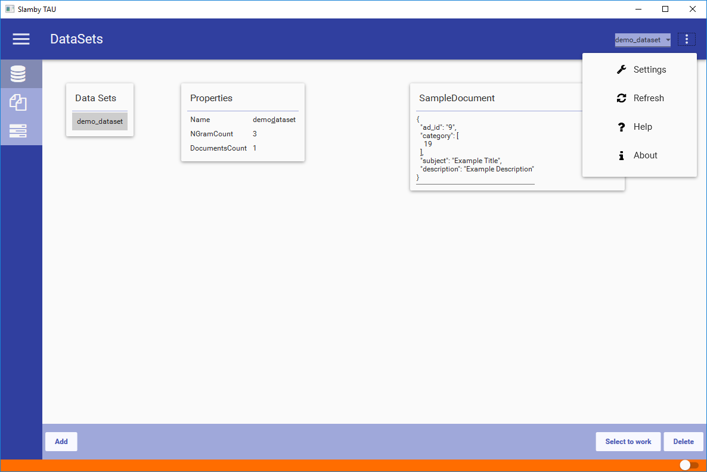

### Left Menu

Main navigation. Available Menu Items:
- Dataset
- Data
- Services

### Status Bar

Orange colored status bar in the bottom. Quick access to descriptive data. Contains Status Window.

#### Status Window

Displays full server-client communication. You can check each request & response manually.

> `Tip:` Use Status Window to analyze your queries to help integration.

> `Warning:` When status window is open, loaded data can cause memory issue.

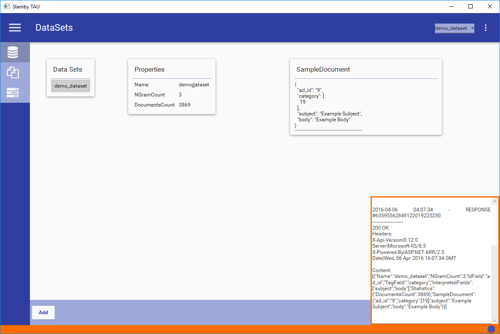

# Dataset

First main section. Managing datasets.

> In Slamby you can create your databases as datasets. A dataset is a schema-free JSON storage, with robust indexing, clustering and analytics. 

Available functions:
- Create Dataset,
- Remove Dataset,
- Set Dataset to Work,
- Open Dataset to Work.

## Create a Dataset

To create a dataset you need to fill a form with the following parameters:

`Name`: name of the dataset. Use A-Z,a-z,0-9_ characters.

`NgramCount`: Maximum n-gram value of your database. `Default value is 3`.

`TagField`: the tagfield name from your sample JSON document.

`InterpretedFields`: fields from your sample JSON document which contains text to analyze.

`SampleDocument`: sample JSON document to define your dataset's schema.

> Tip: use the built-in JSON validator.

## Select Dataset To Work

To select a dataset to work, click on `select to work`, or double-click on it. You can check the selected dataset in the header - in the dataset selector.

## Import Document into Dataset

To import document into your dataset, select your target dataset, right-click and select Import Document from ... menu item. You can select Import Document from JSON or from CSV.
After selecting the right import format, you can select the source file using your file browser.

After selecting the source file - a setting window pops-up. Here you can set the delimiter that will apply during CSV parsing. There is also a force import checkbox.

`Using force mode`, all the errors will be detected and reported, but the import will be continued anytime. Not using Force mode, import process will stop when the first error detected.

**CSV Import**

Import from CSV source. Built-in bulk process is automatically activated.
Reading and parsing is partial, there is no memory leak threat.

**JSON Import**

Import from JSON source. Built-in bulk process is automatically activated. Source file is loaded into memory, than during the parsing, bulk upload is available.
`Avoid memory leak`.

### Format and Fields

In the CSV or JSON template file - you should use the same field names just in your dataset template. Filed match process is automated.

> Tip: during CSV import you can set the bulk import number in the settings.
 
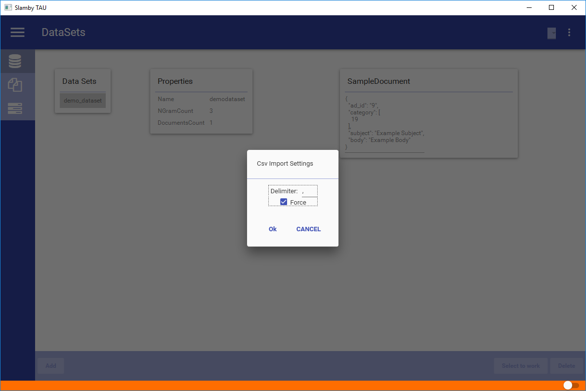

### Import Progress Bar

When import starts a progress bar pops-up. You can see the estimated progress, the successfully imported document number and the error number occurred.

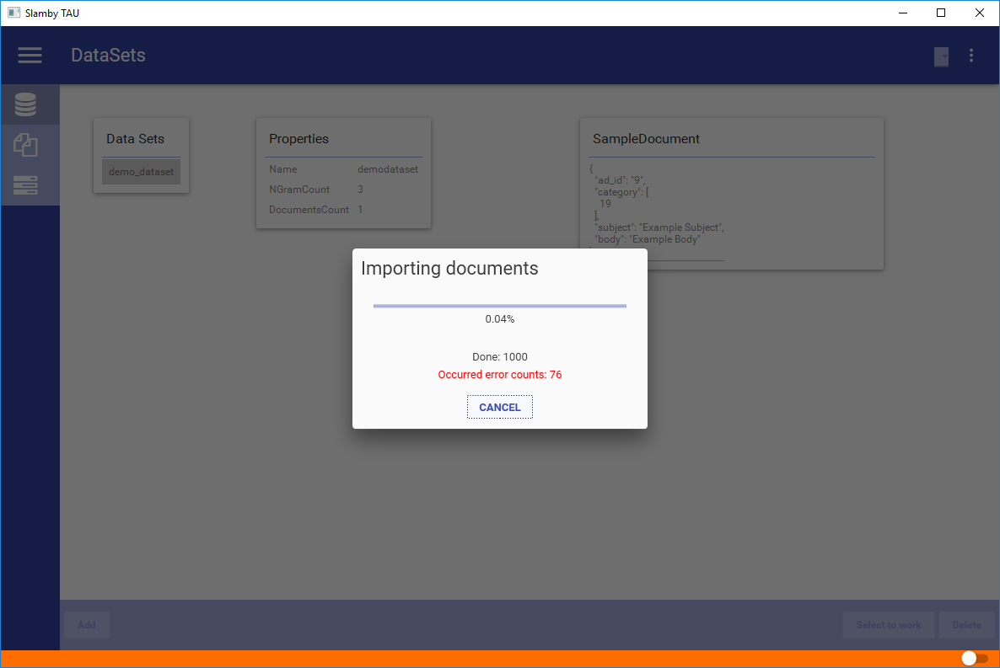

## Import Tag into Dataset

Each dataset has a tag storage. You can easily create and manage your tags. During tag import you can use JSON or CSV format. To import tags, select the target dataset, right-click and select Import Tag from CSV or JSON.
After selecting the right import process select the source file using file browser. A setting window pops-up to select the delimiter and the force option.

**Important**

Format and field names are given. `Id, Name, ParentId`.

*Sample Category CSV*

Id  |   Name    |   ParentId
--- |   ---     |    ---
7   |   Animal  |   Null
9   |   Dog     |   7
10  |   Cat     |   7
11  |   Chihuahua    |   9

> Tip: organize your tags into hierarchy and use it as a category tree.

## Remove Dataset

To remove a dataset select your target dataset, right-click and select *Remove*. A security window pops-up, to make sure you are going to remove the right dataset. After pressing Ok, the dataset is going to be removed.

**Important**

After removing a dataset, each documents and tags will be removed.

> Tip: to delete all your documents it's faster to remove and re-create the given dataset.

# Data management

Here we are. Under Data Management you can manage your documents and tags inside a dataset. Two tabs are available:
- Documents
- Tags.

Basically you can search, examine, and edit your data.

> Tip: use data management tab to create statistical samples for your experiments.

## Documents

In Documents tab the main focus is to manage your live dataset.

Available functions:
- Add new document,
- Create complex search queries,
- Create statistical, random samples,
- Edit your documents,
- Copy or Move your document into another dataset,
- Manage your tags related to given documents.

> Tip: managing documents use the available right-click options.

### Add New Document

Adding a new document you use json format. In the editor you can see the json document template that you used during the dataset creation process.
Change the template document with your content.

To save the document click Ok.

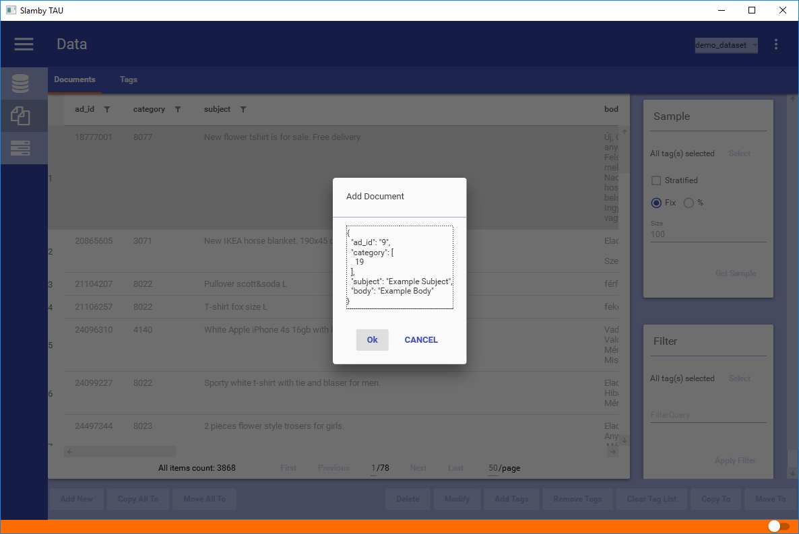

### Copy To, Copy All To

Copy the selected documents to another dataset. Pops up a target dataset selector, showing your available datasets. Select your target dataset and click on Select.
Copying process starts in the background.

To copy all of your documents from your entire dataset use `Copy All To` option. Using this option it's not necessary to select any document, it will automatically affect each of it.

**Important**

The target dataset should have the same template then your current dataset to copy your documents.

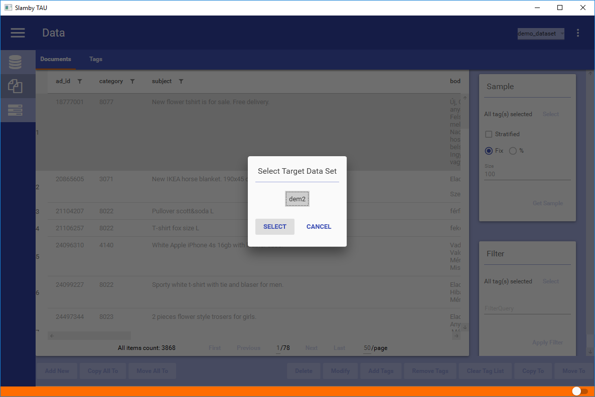

### Move To, Move All To

Move the selected documents to another dataset. Pops up a target dataset selector, showing your available datasets. Select your target dataset and click on Select.
Moving process starts in the background.

To move all of your documents from your entire dataset use `Move All To` option. Using this option it's not necessary to select any documents, it will automatically affect each of it.

**Important**

The target dataset should have the same template then your current dataset to move your documents.

### Remove Documents

Removes the selected documents from your dataset. Pops up a confirmation window to confirm your action.

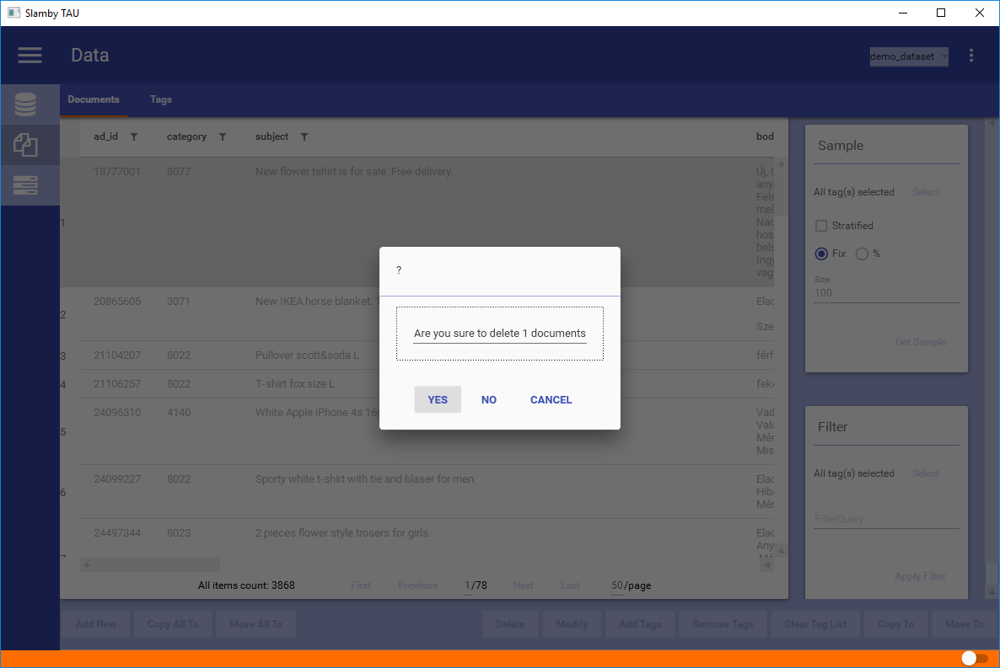

### Edit Document

Document JSON editor pops up. You can see your json document to edit. After editing click ok. Changes are automatically saved into your dataset.

> Tip: use built-in json validator.

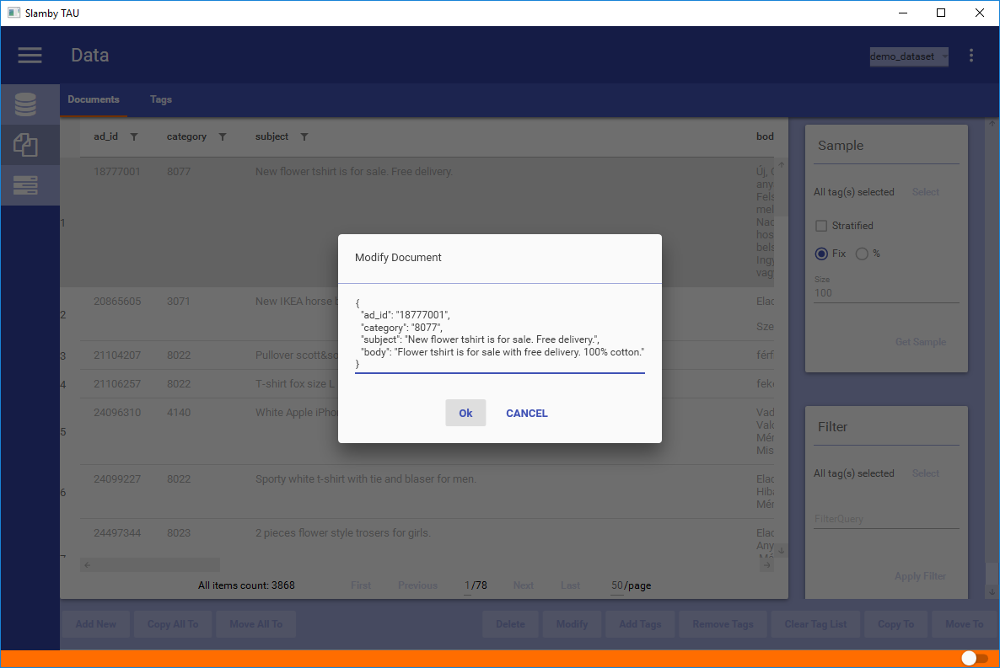

### Add Tags

Adding tags to a selected document manually. Pops up a tag selector. You can see your full tag list. Using built-in filter option you can select your required tags.

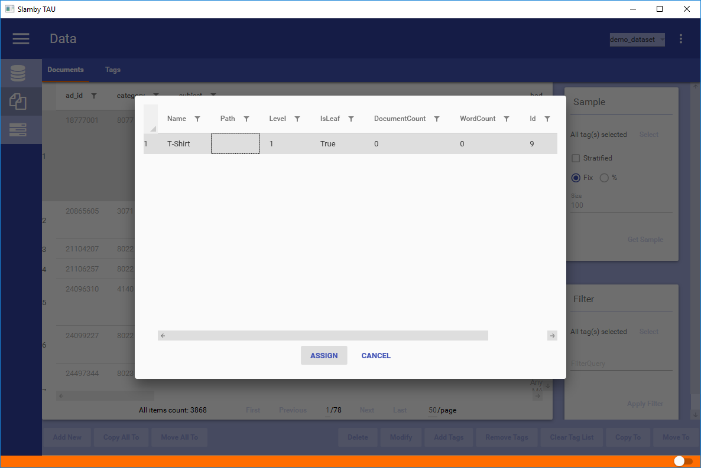

### Remove Tags

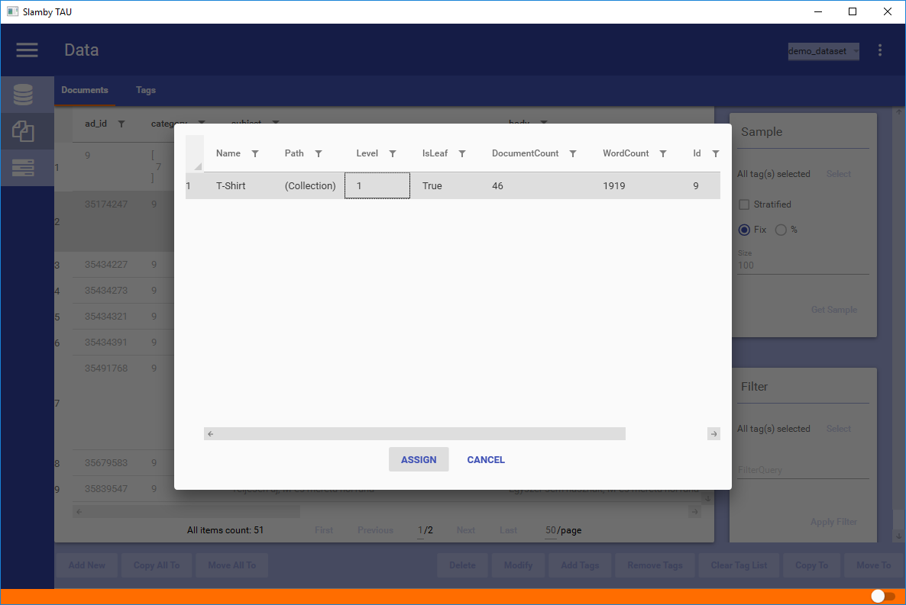

### Clear Tag List

Removes tags from selected documents instantly.

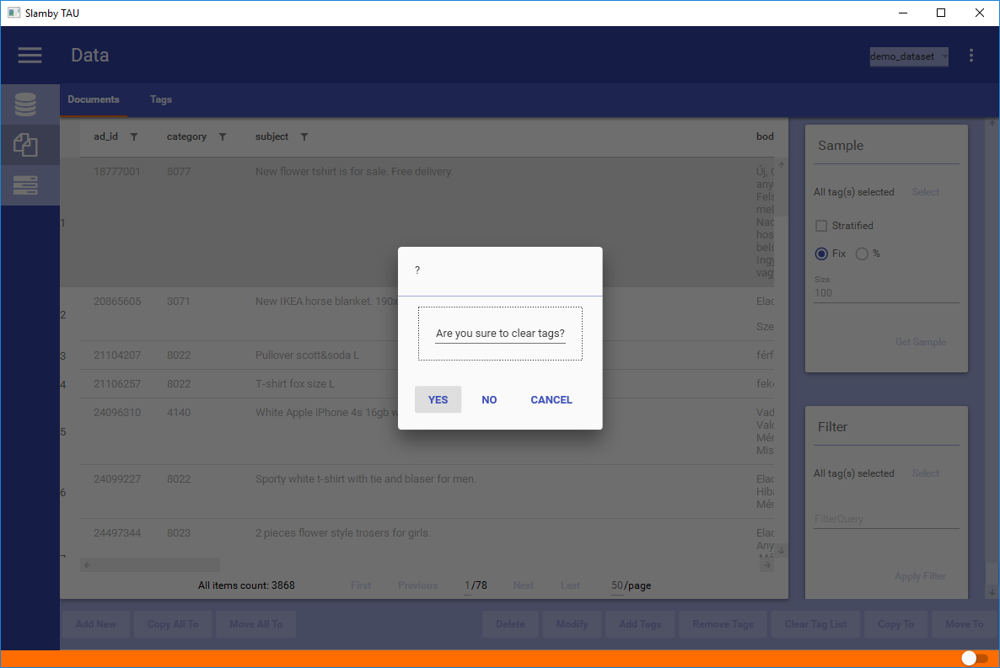

### Sampling

Create random selection from dataset.
Available options:
- Filter by tags,
- Stratified or Normal sampling procedure,
- Fix number, or % sample size definition,
- Sample Size definition.

*Filter by tags*

You can select from which tags you would like to create your samples. For a general e-commerce sampling a typical usage: select all the leaf level tags and use them for sampling.

*Sampling procedure*

You can use normal sampling, using your fill dataset-part as the whole dataset, then using a statistically random selection process.
Using Stratified method, sampling will be created tag by tag, using the same size declaration process.

> Tip: for general e-commerce sampling use normal sampling procedure.

*Sampling Size Definition*

You can define your sample size in pre-defined number or %. Using a fix number such as 10000, your sample size will be 10 000. Using a 10% relative sample size in the case of have a dataset with 1 million documents, the sample size will be 100 000.

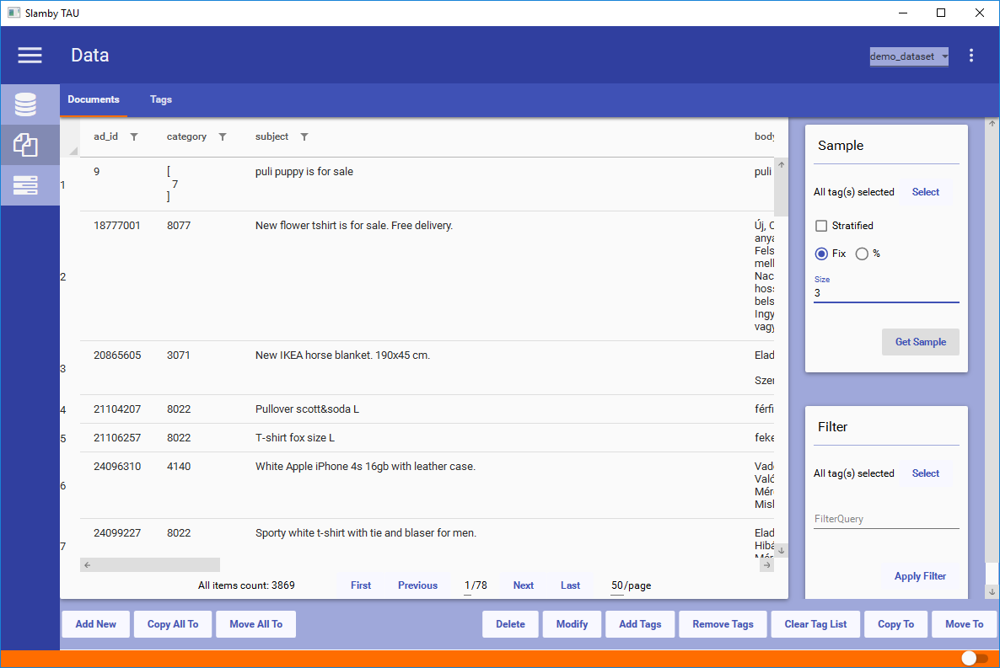

For tag filtering use our built-in tag selector:

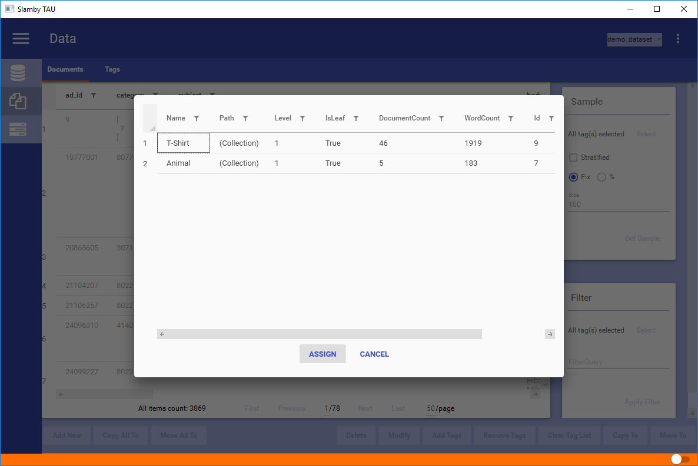

*Example Filter Result - using fix size (3), non-stratified sample from each categories:*

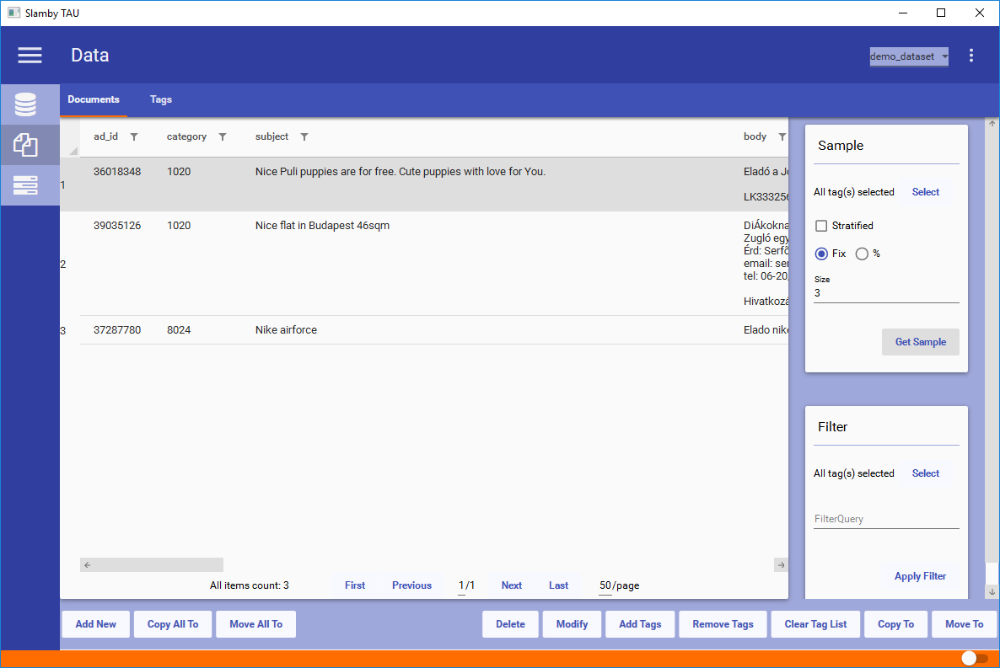

### Filter

Use filter for complex search processes.

With Filter you can:
- Filter by tags,
- Filter by any fields,
- Use Logical Expression,
- Use Wildcards,
- Use multiple queries with hierarchy.

*Filter uses built-in search engine with powerful and fast search capabilities.*

> Tip: build powerful, real-time search function using Filter.

*Example Search Query and Result - with multiple queries with hierarchy:*

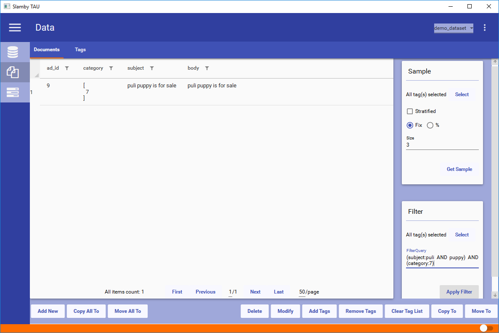

## Tags

Managing tags. Available options:
- Get Tags,
- Add New Tag,
- Modify Tag,
- Remove Tag.

> Tip: for e-commerce usage organize your tags into hierarchy and use it as a category tree.

### Get Tags

Check your available tags. Use built-in filter on your columns.

*Available columns:*

Name    |   Description
---     |   ---
Name    |   Tag Name
Path    |   Hierarchy full path of the given tag
Level   |   Tag level in a given hierarchy path
IsLeaf  |   True / False. True when a tag is the last available (Leaf) node in a path.
DocumentCount   |   Available, current document number relates to the tag.
WordCount   |   Available, current word number relates to the tag.
Id  |   Id of the tag.
ParentTagId |   Parent Tag Id of the tag.

> Tip: use built-in filter in the header to filter your required tags. 
Tip: to copy tag id list select the required tags and press ctrl+c. You can find your JSON Tag ID list in your clipboard.

*Example Tag Window:*

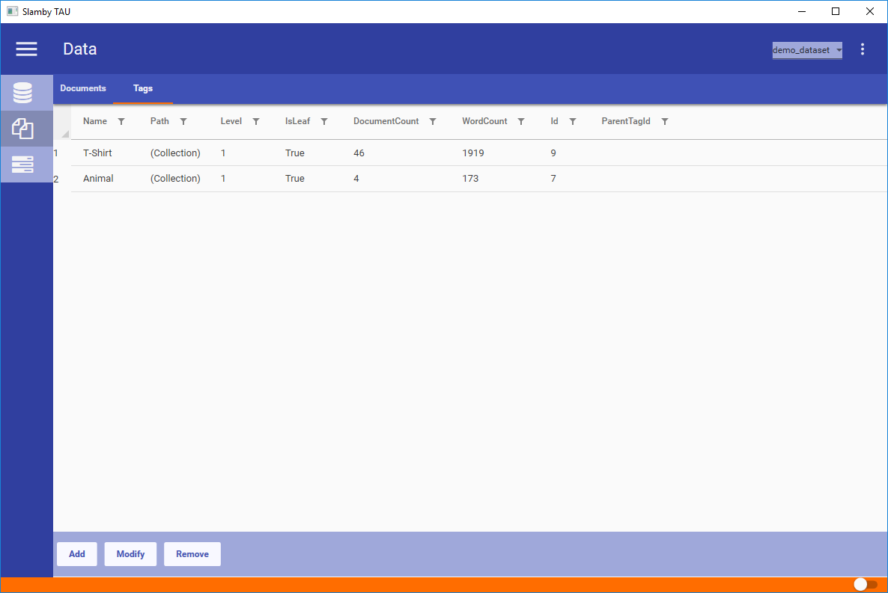

### Add Tag

To add a new tag, you need to fill a sample json document.

Available parameters: *id, name, parentid*.

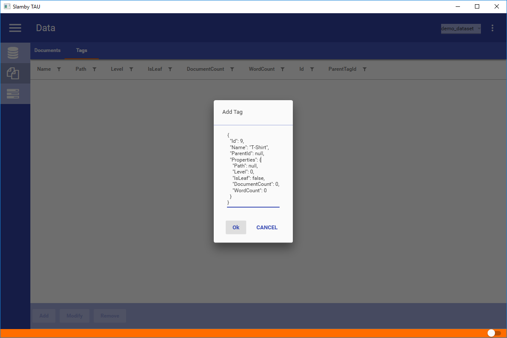

### Modify Tag

To modify a tag, change the tag json document.

**Important** Modifying a tag id, does not influence your tags stored in documents.

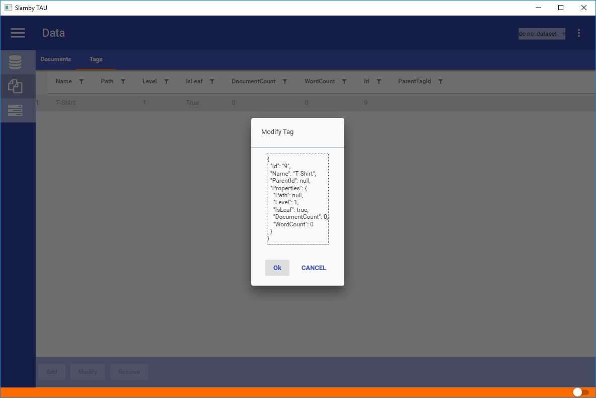

### Remove Tag

Removing a tag, accept your validation form. Tag won't be removed from documents.

**Important** All the children tags will be removed.

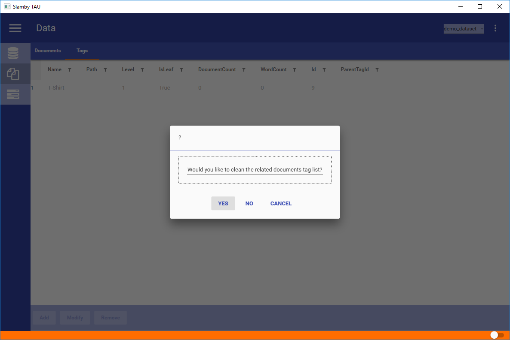

# Services

Using Slamby you can freely create data processing services. Each service has a dedicated API endpoint that you can use for data processing.
Each service has custom settings availability to create a customized processor.

Service creation steps:
1. Create Empty Service,
2. Provide custom setting and start training/preparation,
3. Provide custom activation settings,
4. Activate service.

No. |   Stage   |   Description
--- |   ---     |   ---
1.  |   Create Empty Service    |   To create a service, first step is to create an empty one. During this process you can select the type of the service, provide the name and description of it. When the service is ready, the service unique ID already exists. After creation process is done the service status is `New`
2.  |   Preparation |   Next step is to prepare the service. During this process you can set your custom settings about the training process. When preparation starts, service status will be changed to `Busy`. When the preparation finishes, the status will be changed to `Prepared`.
3.  |   Activation  |   Prepared services can be activated. When a service is prepared it means the training and setting process is ready, the service is ready to use, all the required files are ready to use. Without activation you cannot use the service. Before activation you can set your custom settings about the API endpoint to customize your data processing. During activation Slamby server reads the service and related files, opening an available API endpoint, loading the service into memory and become ready to serve your requests. When the service is activated, the status will be changed to `Activated`. 
4.  |   Test a Service  |   You can test your activated service by clicking on the recommend button. A test window pops-up with the available service details as a JSON document. You can fill it out and send your request to the service API endpoint. After sending your request you can see the response.

*Currently Available Services:*

Name    |   Description
---     |   ---
Classifier  |   Text Classification service, using Slamby's Twister classification technology. High accuracy level, managing high number of categories, managing training database mistakes.
PRC |   Similar Text Recommendation & Keyword extraction service. Analyzes a given text, automatically highlights the keywords and looking for the most similar documents from a given tag array. Use it for similar product recommendation, or product duplication checking.

## Classifier Service

Text classification service using Slamby Twister classification technology. Easily create classification service with high capacity and accuracy.

Benefits of using Classifier Service:

Name    |   Description
---     |   ---
Algorithm   |   Slamby Twister.
High Accuracy Level   |   95-99% accuracy level. Generally 30% higher than industrial average and 30%+ higher than Naive Bayes classifiers.
Managing High Volume of Categories  | Managing thousands of categories with the same accuracy level.
Fast Decision Making    |   Ultra-fast classification. Depends on your available resources, starts 5/sec classification performance - using 1000 categories and 30 words input text size. Up-to thousands / sec capacity.
Managing Training Dataset Mistakes  |   Effectively managing mistakes in the training dataset. Specialized for real-life needs, providing the same accuracy level, managing mistakes up to 30%.
Automated Decision Making Support   |   Use score to predict the quality of the recommendation. Using score, define your threshold for automated decision-making.
Language Independent    |   Slamby Twister is completely language independent, providing the same accuracy level in Asian and Arabic languages (such as Malaysian, Thai, Vietnamese) then in others.

*Empty Service Window example:*

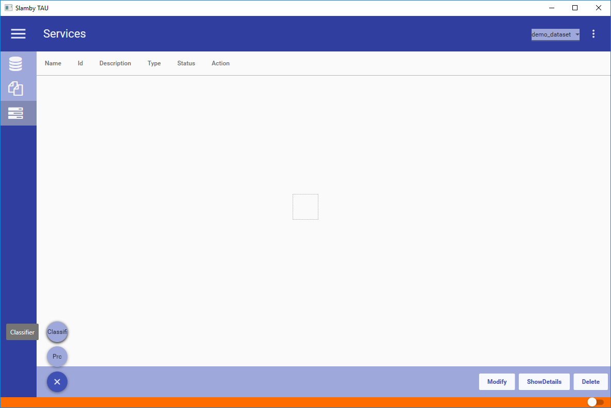

### Create Classifier Service

To create a Classifier Service, provide the required name and a short description of it. Select Classifier as a type of service, and click on the Ok button. The service is going to be displayed with `New` status.

*Example Classifier Service Creation First Step*:

### Prepare Classifier Service

To prepare Classifier Service, you can provide your custom settings as a single JSON.

Available settings:

Name    |   Description
---     |   ---
DataSetName |   Source Dataset name that you are going to use to create Classifier Service. During the preparation process the given dataset will be used to train the service.
TagIdList   |   Tag IDS that you are going to use for classification. When you keep it empty, all the Leaf Tag Ids will be used for classification.
NGramList   |   Set the n-gram list you would like to use during your classification. When your n-gram setting is 1,2,3, Classifier service will create the classification model for the given 1,2,3 grams.

> Tip: to select your custom Tag Ids and paste it into the JSON setting, select your required Tags in Data>Tags, and press ctrl+c, then ctrl+v in the json document. The selected Tag IDs array will be pasted as a JSON array.

*Example Preparation Setting Window before preparation*:

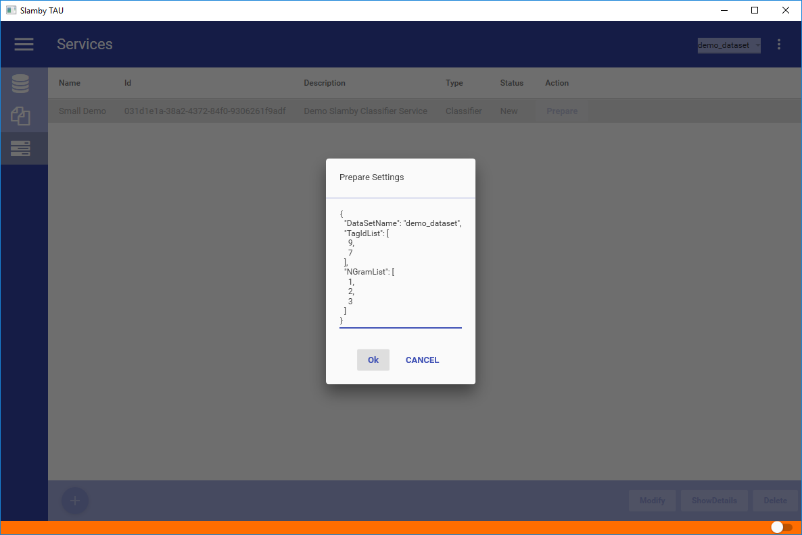

*Example service with `Busy` Status*:

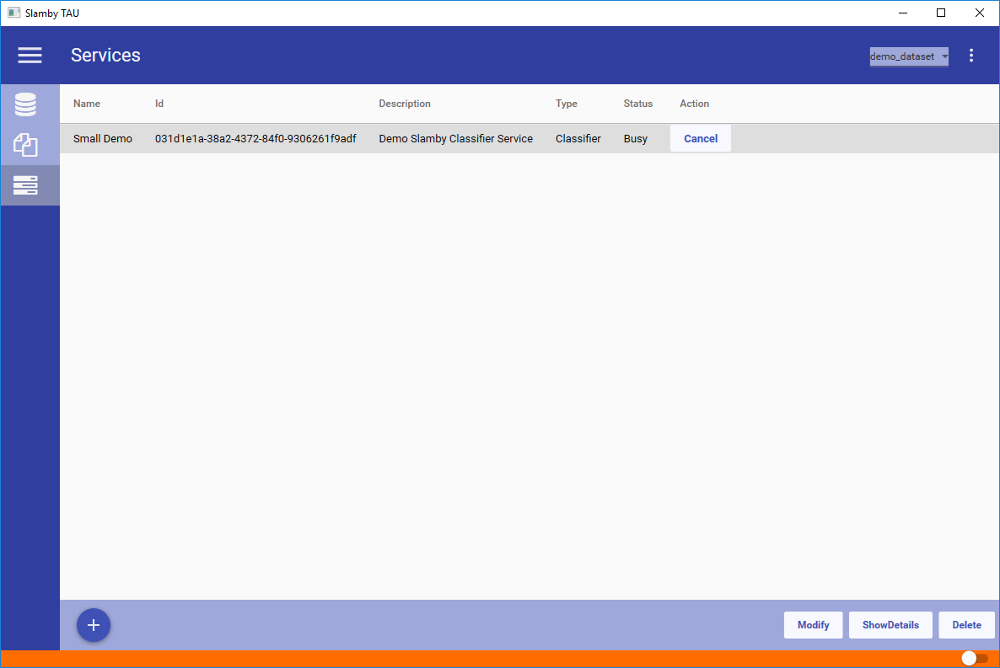

*Example service with detailed status information* - You can see the preparation process in the `Percent` field of the actual process:

> Tip: you can easily get the process status by process id.

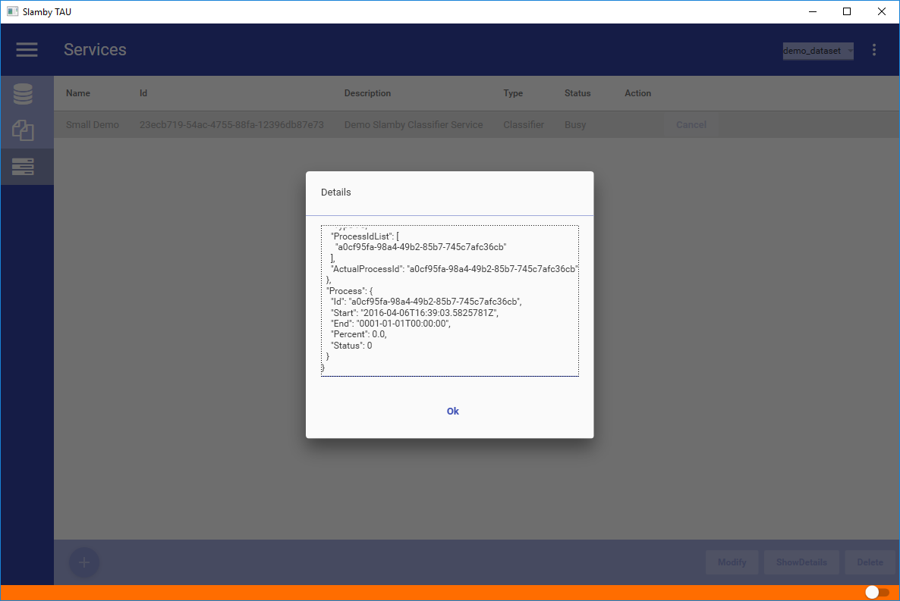

*Example service with `Prepared` Status*:

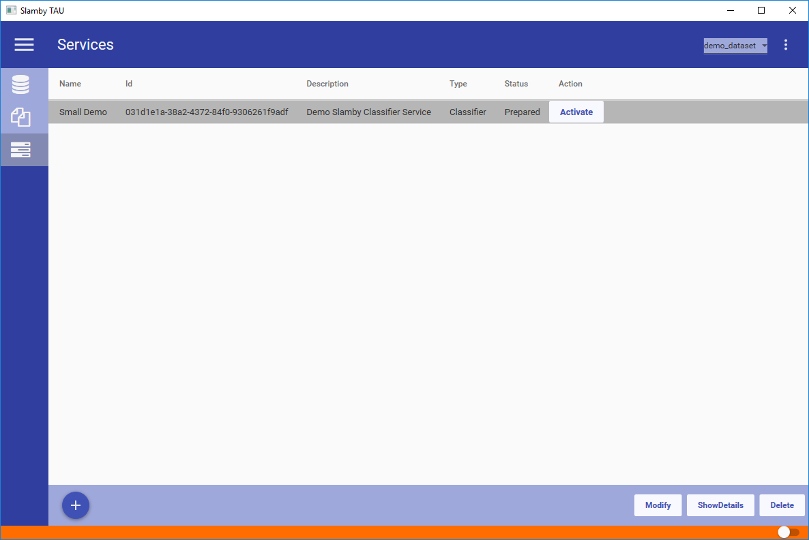

### Activate Classifier Service

To use a Classifier Service, it needs to have `Activated` Status. During activation process, all the service related files load into the Server Memory and opening a dedicated API endpoints that is able to process your requests.

To activate a service you can use your custom activation settings.

Available activation settings:

Name    |   Description
---     |   ---
EmphasizedTagList   |   Tag IDs to use for emphasized classification. In this case the selected Tag Names will be modified the classification.
TagIdList   |   Selected Tag IDs from the prepared list to use for classification. In the case of Null value, all the prepared Tag IDs will be used.
NGramList   |   Which n-gram model would you like to use during the classification. You can select from the prepared model.

> Tip: try Classifier Service with different activation settings to get the maximum result.

*Example Classifier Service Activation JSON*:

*Example Classifier Service with `Activated` Status*

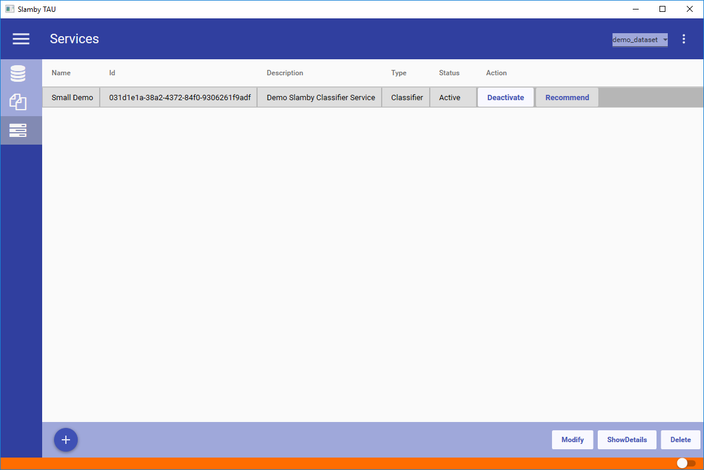

### Use Classifier Service

To test Classifier Service, click on the `Recommend` button. Fill the JSON setting input form with the available settings and send your request to the Service API endpoint.

Available JSON settings:

Name    |   Description
---     |   ---
Text    |   Text to analyze by the Classifier Service. This text will be analyzed and used for classification.
Count   |   The response tag number to display.
UseEmphasizing  |   When Emphasize function is enabled, here we can set to use it for classification.
NeedTagInResult |   When it's value it `true` we can see a detailed response by tags - such as Tag Id, Tag Name, Tag Parent ID and related properties.

*Example Recommend JSON as `request`*:

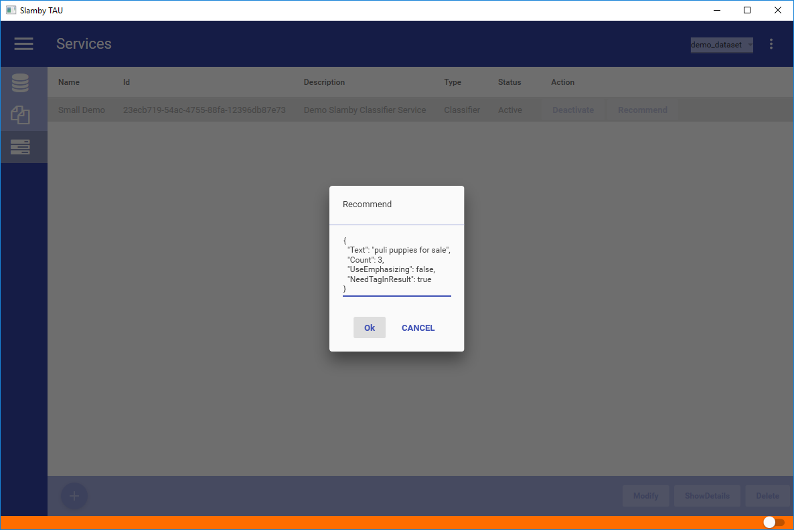

#### Classifier Service Response

The response contains the following fields and values:

Field Name  |   Description
--- |   ---
TagId   |   Recommended Tag ID
Score   |   Quality Score related to the Tag. Number between 0-1, where higher is better. Score defines the probability relevant order, but *Score is not probability*
Tag.Id  |   Tag ID
Tag.Name    |   Tag Name
Tag.ParentId    |   ParentId of the recommended Tag
Tag.Properties  |   Related properties by the recommended Tag.

*Example Classifier Service JSON `response`*:

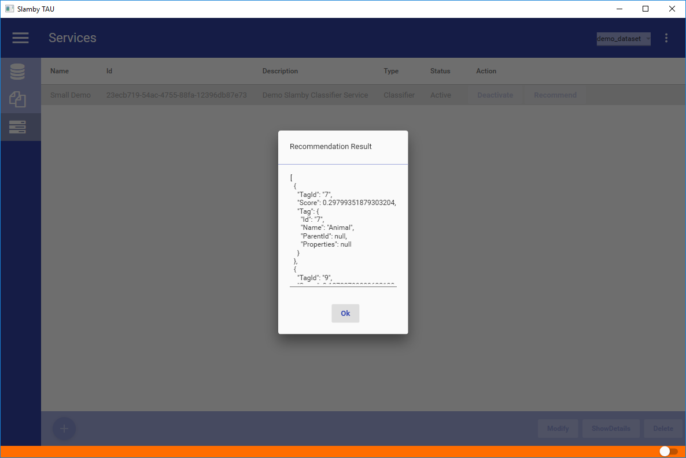

---------------------------------

## Third-party libraries

[CsvHelper](https://github.com/JoshClose/CsvHelper)

[DataGridExtensions](http://datagridextensions.codeplex.com/)

[Dragablz](https://dragablz.net/)

[FontAwesome.WPF](https://github.com/charri/Font-Awesome-WPF/)

[log4net](http://logging.apache.org/log4net/)

[MaterialDesign (MaterialDesignThemes & MaterialDesignColors)](https://github.com/ButchersBoy/MaterialDesignInXamlToolkit)

[MvvmLight](http://www.galasoft.ch/mvvmÖ)

[Newtonsoft.Json](http://www.newtonsoft.com/json)

----------------------------------

*Made with :heart: by Slamby.*